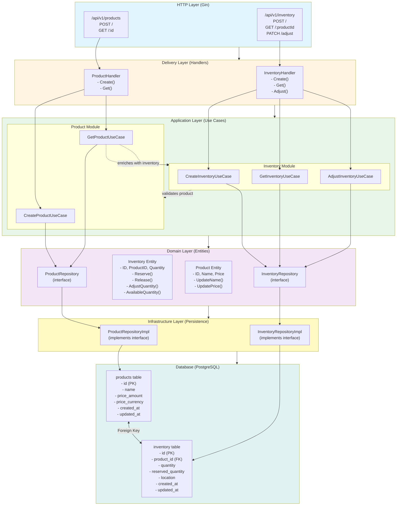
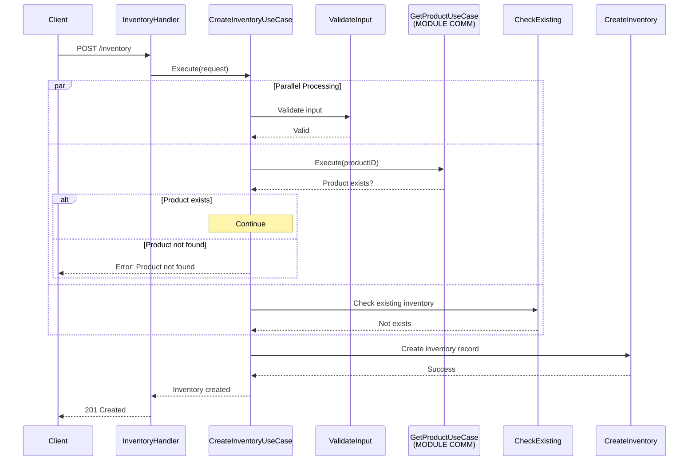
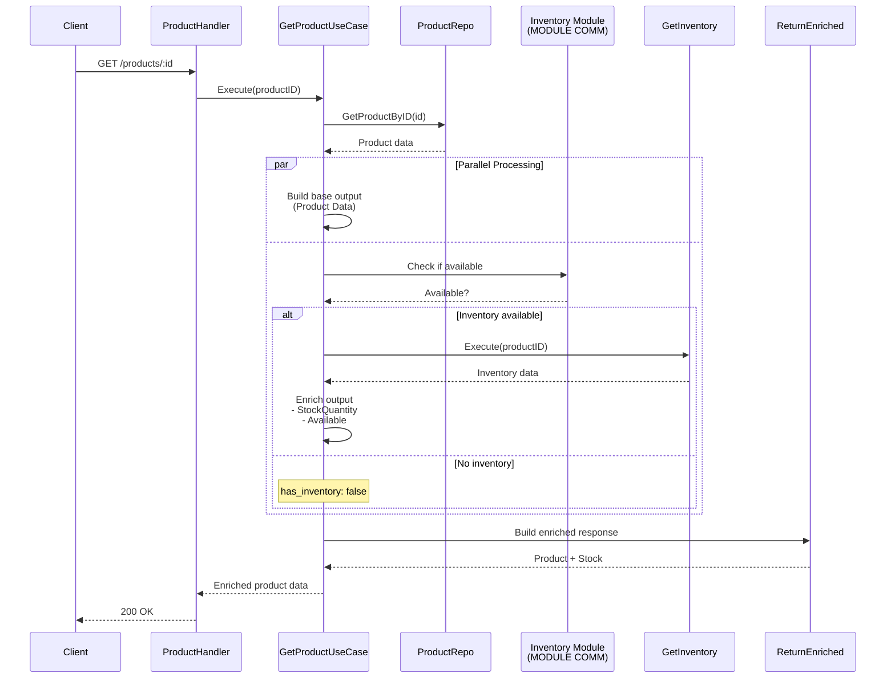
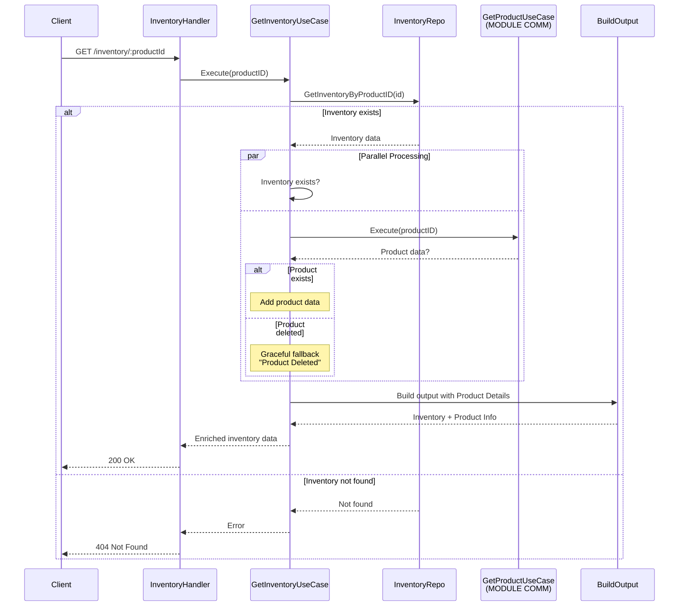
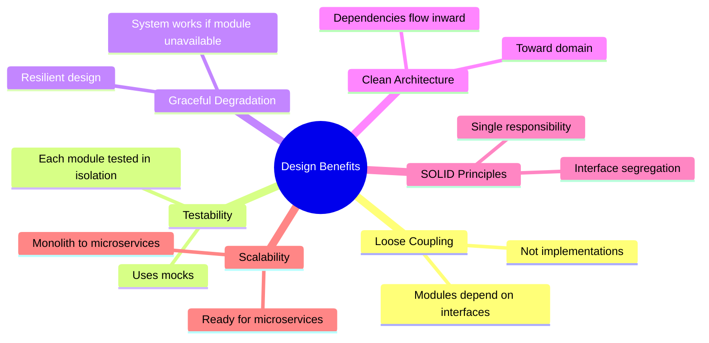
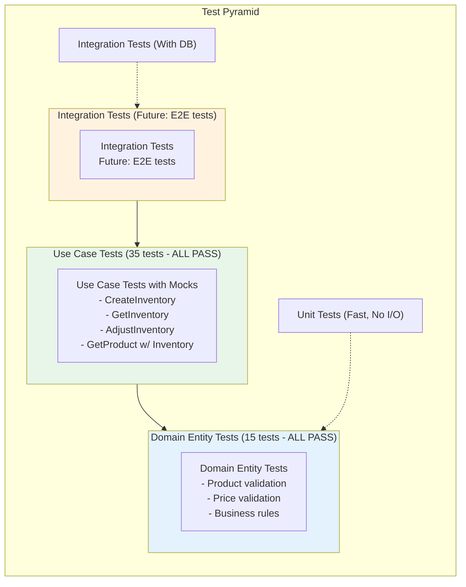

# Module Communication Architecture

## System Overview



## Module Communication Flows

### Flow 1: Create Inventory (Inventory → Product Validation)



### Flow 2: Get Product (Product → Inventory Enrichment)



### Flow 3: Get Inventory (Inventory → Product Enrichment)



## Dependency Injection Flow

```mermaid
flowchart TD
    Start([main.go]) --> Step1[STEP 1: Initialize Repositories]
    
    Step1 --> Step1Code["productRepo := NewProductRepository(db)<br/>inventoryRepo := NewInventoryRepository(db)"]
    
    Step1Code --> Step2[STEP 2: Create Product Use Cases]
    
    Step2 --> Step2Code["createProductUseCase := NewCreateProductUseCase(productRepo)<br/><br/>getProductUseCaseBasic := NewGetProductUseCase(productRepo)<br/>// ← No inventory integration yet"]
    
    Step2Code --> Step3[STEP 3: Create Inventory Use Cases]
    
    Step3 --> Step3Code["createInventoryUseCase := NewCreateInventoryUseCase(<br/>  inventoryRepo,<br/>  getProductUseCaseBasic<br/>  // ← Inventory → Product<br/>)<br/><br/>getInventoryUseCase := NewGetInventoryUseCase(<br/>  inventoryRepo,<br/>  getProductUseCaseBasic<br/>  // ← Inventory → Product<br/>)"]
    
    Step3Code --> Step4[STEP 4: Create Adapter]
    
    Step4 --> Step4Code["inventoryAdapter := NewProductInventoryAdapter(<br/>  getInventoryUseCase<br/>)"]
    
    Step4Code --> Step5[STEP 5: Re-create Product Get Use Case]
    
    Step5 --> Step5Code["getProductUseCase := NewGetProductUseCaseWithInventory(<br/>  productRepo,<br/>  inventoryAdapter<br/>  // ← Product → Inventory<br/>)"]
    
    Step5Code --> Step6[STEP 6: Initialize Handlers]
    
    Step6 --> Step6Code["productHandler := NewProductHandler(<br/>  createProductUseCase,<br/>  getProductUseCase<br/>  // ← Uses version with inventory<br/>)<br/><br/>inventoryHandler := NewInventoryHandler(<br/>  createInventoryUseCase,<br/>  getInventoryUseCase,<br/>  adjustInventoryUseCase<br/>)"]
    
    Step6Code --> End([Application Ready])
    
    style Start fill:#e3f2fd
    style Step1 fill:#fff3e0
    style Step2 fill:#fff3e0
    style Step3 fill:#fff3e0
    style Step4 fill:#fff3e0
    style Step5 fill:#fff3e0
    style Step6 fill:#fff3e0
    style End fill:#e8f5e9
```



## Key Communication Interfaces

### Product Module Interface (for Inventory)
```go
type ProductUseCaseInterface interface {
    Execute(ctx context.Context, productID string) (*GetProductOutput, error)
}
```

### Inventory Module Interface (for Product)
```go
type InventoryUseCaseInterface interface {
    Execute(ctx context.Context, productID string) (InventoryData, error)
}

type InventoryData interface {
    GetQuantity() int
    GetAvailableQuantity() int
}
```

## Benefits Visualization



## Testing Strategy



This architecture demonstrates production-ready module communication patterns that can scale from monolith to microservices while maintaining clean boundaries and testability.
