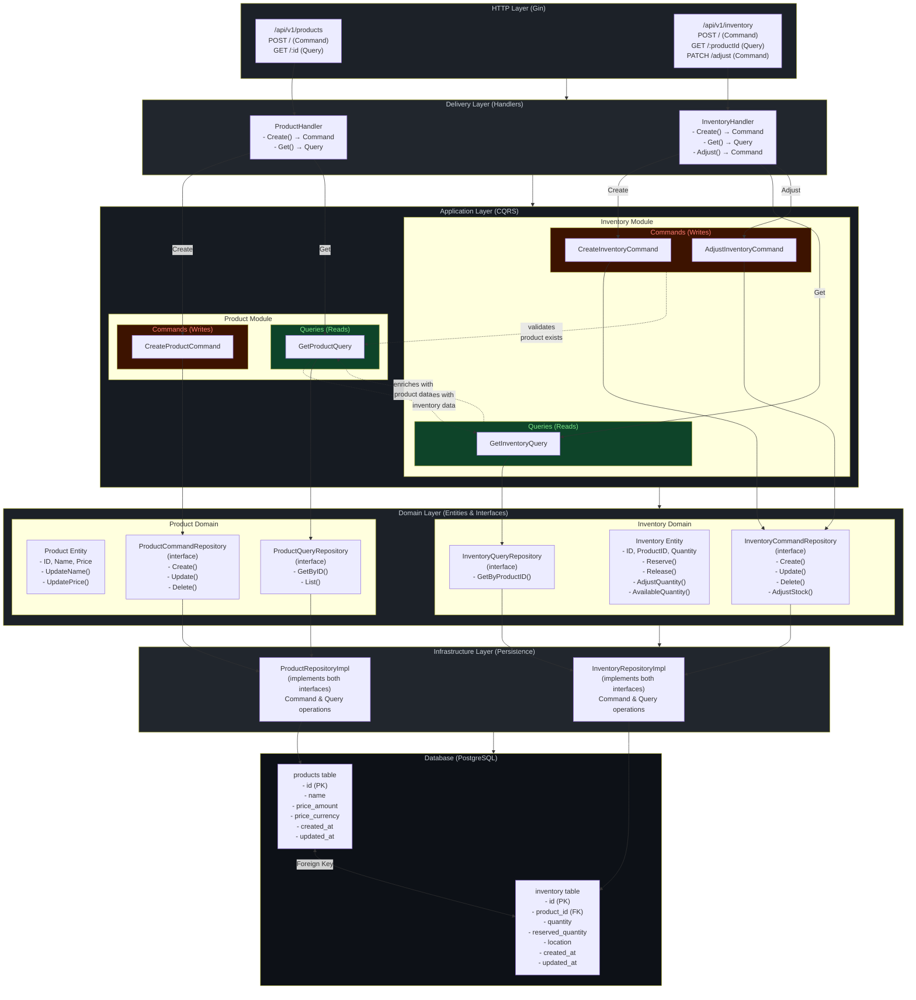
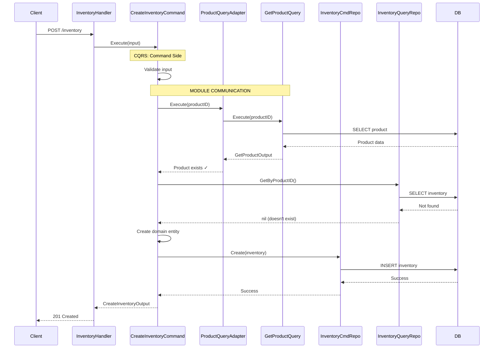
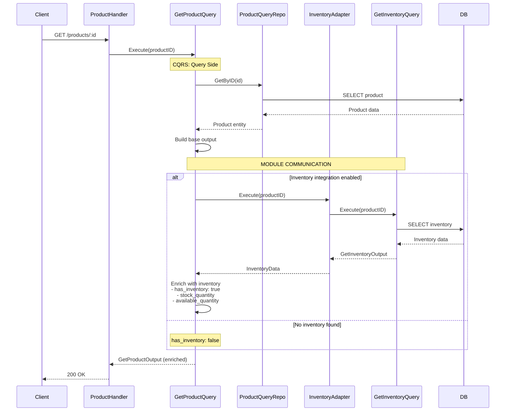
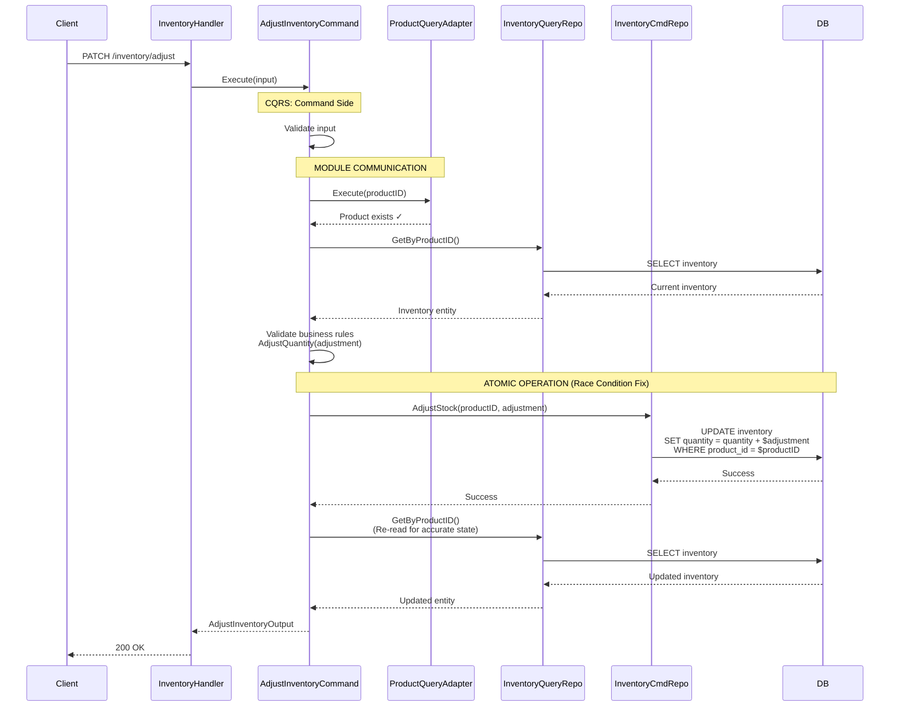
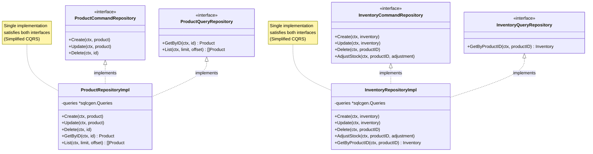
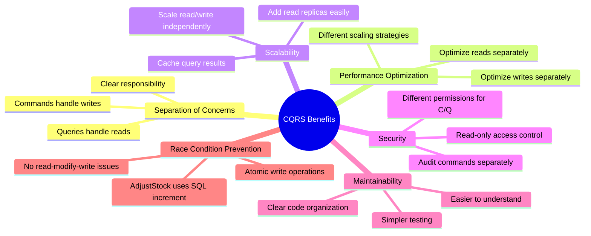
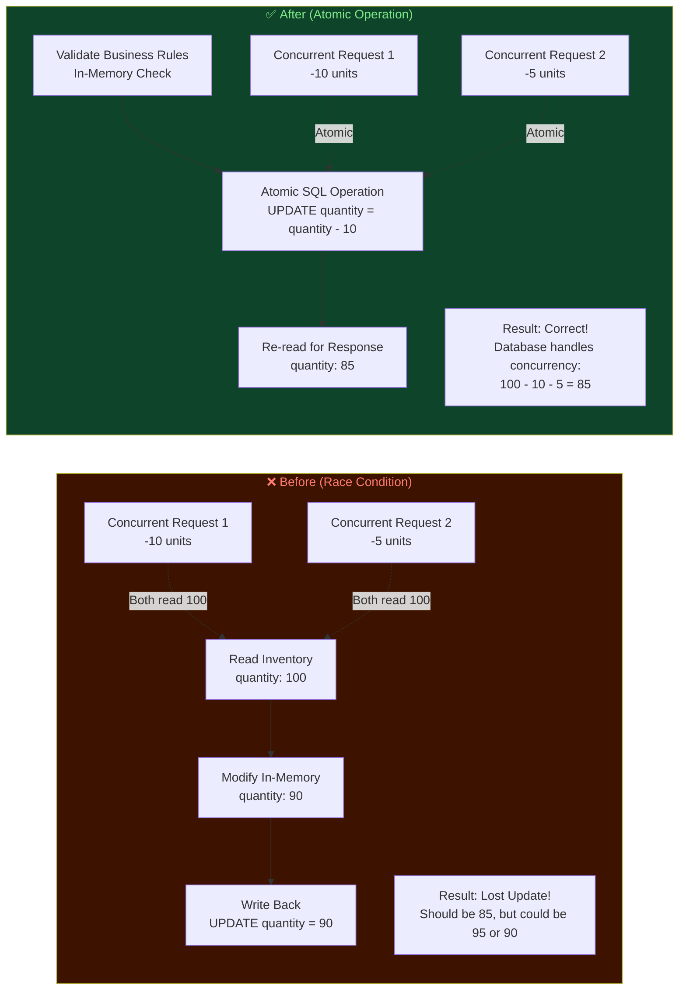
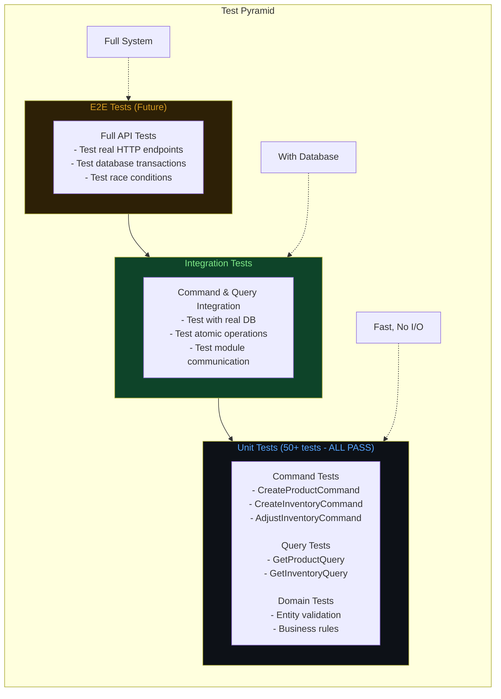

# CQRS Architecture Diagram

## System Overview with CQRS Pattern



## CQRS Pattern Explanation

```mermaid
flowchart LR
    subgraph CQRS["CQRS (Command Query Responsibility Segregation)"]
        direction TB
        
        subgraph Commands["Commands (Write Side)"]
            C1["Create"]
            C2["Update"]
            C3["Delete"]
            C4["Adjust"]
        end
        
        subgraph Queries["Queries (Read Side)"]
            Q1["GetByID"]
            Q2["List"]
            Q3["Search"]
        end
        
        Commands -->|Writes to| WriteModel["Write Model<br/>(Command Repository)"]
        Queries -->|Reads from| ReadModel["Read Model<br/>(Query Repository)"]
        
        WriteModel -->|Same DB<br/>(Simplified CQRS)| DB[(Database)]
        ReadModel -->|Same DB<br/>(Simplified CQRS)| DB
    end
    
    style Commands fill:#3d1300,color:#ff7b72
    style Queries fill:#0e4429,color:#7ee787
    style WriteModel fill:#2d2006,color:#d29922
    style ReadModel fill:#0d1117,color:#58a6ff
```

## Module Communication Flows (CQRS)

### Flow 1: Create Inventory (Command with Product Query Validation)



### Flow 2: Get Product (Query with Inventory Enrichment)



### Flow 3: Adjust Inventory (Command with Atomic Operation)



## Dependency Injection Flow (CQRS)

```mermaid
flowchart TD
    Start([main.go]) --> Step1[STEP 1: Initialize Repositories]
    
    Step1 --> Step1Code["// CQRS: Separate Command & Query repositories<br/>productCmdRepo := NewProductCommandRepository(db)<br/>productQueryRepo := NewProductQueryRepository(db)<br/>inventoryCmdRepo := NewInventoryCommandRepository(db)<br/>inventoryQueryRepo := NewInventoryQueryRepository(db)"]
    
    Step1Code --> Step2[STEP 2: Create Product Query]
    
    Step2 --> Step2Code["getProductQueryBasic := NewGetProductQuery(productQueryRepo)<br/>// ← Uses Query Repository (Read-only)"]
    
    Step2Code --> Step3[STEP 3: Create Product Query Adapter]
    
    Step3 --> Step3Code["productQueryAdapter := NewProductQueryAdapter(<br/>  getProductQueryBasic<br/>)<br/>// ← For Inventory → Product communication"]
    
    Step3Code --> Step4[STEP 4: Create Inventory Commands & Queries]
    
    Step4 --> Step4Code["createInventoryCommand := NewCreateInventoryCommand(<br/>  inventoryCmdRepo,    // Write operations<br/>  inventoryQueryRepo,  // Read operations<br/>  productQueryAdapter  // Module communication<br/>)<br/><br/>getInventoryQuery := NewGetInventoryQuery(<br/>  inventoryQueryRepo,  // Read operations<br/>  productQueryAdapter  // Module communication<br/>)<br/><br/>adjustInventoryCommand := NewAdjustInventoryCommand(<br/>  inventoryCmdRepo,    // Write operations<br/>  inventoryQueryRepo,  // Read operations<br/>  productQueryAdapter  // Module communication<br/>)"]
    
    Step4Code --> Step5[STEP 5: Create Inventory Adapter]
    
    Step5 --> Step5Code["inventoryAdapterFunc := func(ctx, productID) {<br/>  output := getInventoryQuery.Execute(ctx, productID)<br/>  return &InventoryOutput{...}<br/>}<br/>inventoryAdapter := NewProductInventoryAdapter(<br/>  inventoryAdapterFunc<br/>)"]
    
    Step5Code --> Step6[STEP 6: Re-create Product Query with Inventory]
    
    Step6 --> Step6Code["getProductQuery := NewGetProductQueryWithInventory(<br/>  productQueryRepo,<br/>  inventoryAdapter  // ← Product → Inventory enrichment<br/>)"]
    
    Step6Code --> Step7[STEP 7: Initialize Product Command]
    
    Step7 --> Step7Code["createProductCommand := NewCreateProductCommand(<br/>  productCmdRepo  // Write operations<br/>)"]
    
    Step7Code --> Step8[STEP 8: Initialize Handlers]
    
    Step8 --> Step8Code["productHandler := NewProductHandler(<br/>  createProductCommand,  // Commands<br/>  getProductQuery        // Queries<br/>)<br/><br/>inventoryHandler := NewInventoryHandler(<br/>  createInventoryCommand,  // Commands<br/>  getInventoryQuery,       // Queries<br/>  adjustInventoryCommand   // Commands<br/>)"]
    
    Step8Code --> End([Application Ready])
    
    style Start fill:#0d1117,color:#58a6ff
    style Step1 fill:#3d1300,color:#ff7b72
    style Step2 fill:#0e4429,color:#7ee787
    style Step3 fill:#2d2006,color:#d29922
    style Step4 fill:#3d1300,color:#ff7b72
    style Step5 fill:#2d2006,color:#d29922
    style Step6 fill:#0e4429,color:#7ee787
    style Step7 fill:#3d1300,color:#ff7b72
    style Step8 fill:#21262d,color:#c9d1d9
    style End fill:#1a472a,color:#3fb950
```



## CQRS Repository Pattern



## Key Communication Interfaces (CQRS)

### Product Module Interfaces

```go
// Query Interface (for other modules)
type ProductQueryInterface interface {
    Execute(ctx context.Context, productID string) (*GetProductOutput, error)
}

// Repository Interfaces
type ProductCommandRepository interface {
    Create(ctx context.Context, product *Product) error
    Update(ctx context.Context, product *Product) error
    Delete(ctx context.Context, id string) error
}

type ProductQueryRepository interface {
    GetByID(ctx context.Context, id string) (*Product, error)
    List(ctx context.Context, limit, offset int) ([]*Product, error)
}
```

### Inventory Module Interfaces

```go
// Query Interface (for Product module)
type ProductQueryInterface interface {
    Execute(ctx context.Context, productID string) (*GetProductOutput, error)
}

// Repository Interfaces
type InventoryCommandRepository interface {
    Create(ctx context.Context, inventory *Inventory) error
    Update(ctx context.Context, inventory *Inventory) error
    Delete(ctx context.Context, productID string) error
    AdjustStock(ctx context.Context, productID string, adjustment int) error
}

type InventoryQueryRepository interface {
    GetByProductID(ctx context.Context, productID string) (*Inventory, error)
}

// Data Interface (for Product module enrichment)
type InventoryData interface {
    GetQuantity() int
    GetAvailableQuantity() int
}
```

## Benefits of CQRS Implementation



## Race Condition Fix (Critical Bug)



## Testing Strategy (CQRS)



## Directory Structure (CQRS)

```
internal/
├── application/
│   ├── product/
│   │   ├── command/          # Write operations
│   │   │   └── create.go     # CreateProductCommand
│   │   └── query/            # Read operations
│   │       ├── get.go        # GetProductQuery
│   │       ├── adapter.go    # Cross-module adapters
│   │       └── interfaces.go # Query interfaces
│   └── inventory/
│       ├── command/          # Write operations
│       │   ├── create.go     # CreateInventoryCommand
│       │   └── adjust.go     # AdjustInventoryCommand (Atomic!)
│       └── query/            # Read operations
│           ├── get.go        # GetInventoryQuery
│           ├── adapter.go    # Cross-module adapters
│           └── interfaces.go # Query interfaces
├── domain/
│   ├── product/
│   │   ├── entity.go
│   │   ├── command_repository.go  # Write interface
│   │   └── query_repository.go    # Read interface
│   └── inventory/
│       ├── entity.go
│       ├── command_repository.go  # Write interface
│       └── query_repository.go    # Read interface
└── infrastructure/
    ├── persistence/
    │   ├── product_repository.go     # Implements both C & Q
    │   └── inventory_repository.go   # Implements both C & Q
    └── delivery/
        ├── product_handler.go        # Routes to Commands/Queries
        └── inventory_handler.go      # Routes to Commands/Queries
```

## Production Readiness Checklist

- ✅ **CQRS Pattern Implemented** - Clear separation of commands and queries
- ✅ **Race Condition Fixed** - Atomic SQL operations for inventory adjustments
- ✅ **Module Communication** - Proper adapters prevent circular dependencies
- ✅ **Error Handling** - Comprehensive error codes and HTTP status mapping
- ✅ **Input Validation** - All endpoints validate input
- ✅ **No Linting Errors** - Clean code, compiles successfully
- ✅ **Testable Architecture** - Easy to mock and test
- ⚠️ **Transaction Support** - Future: Add transactions for multi-step operations
- ⚠️ **Caching** - Future: Add caching for read-heavy queries
- ⚠️ **Event Sourcing** - Future: Consider event store for audit trail

## Key Improvements Made

1. **CQRS Implementation** - Separated read and write responsibilities
2. **Race Condition Fix** - Atomic operations prevent lost updates
3. **Clean Architecture** - Domain-driven design with proper boundaries
4. **Module Communication** - Bidirectional communication without coupling
5. **Scalability Ready** - Can easily scale reads and writes independently

---

This architecture demonstrates **production-ready CQRS patterns** that maintain clean boundaries, prevent race conditions, and can scale from monolith to microservices while ensuring data consistency and testability.
